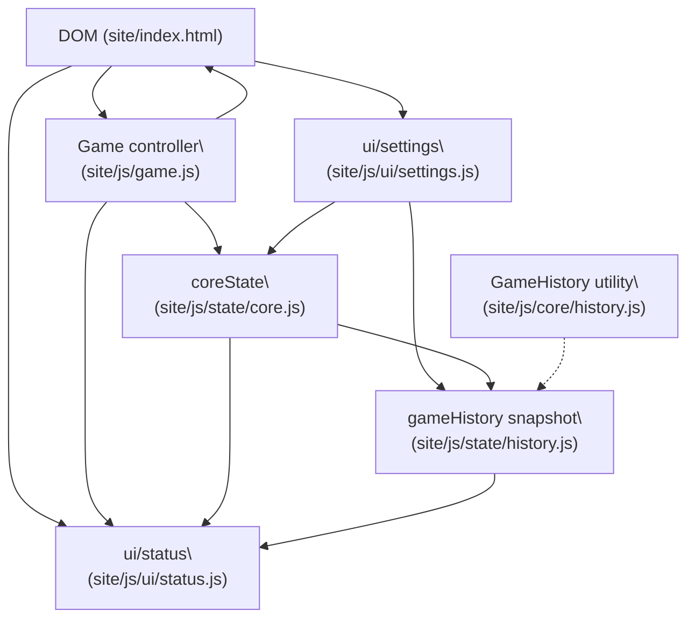

# Tic Tac Toe architecture overview

This guide explains how the browser modules cooperate to power the GitHub Pages deployment. Use it when extending the game engine, wiring AI, or adding persistence so new code hooks into the correct layer.

## Module relationships

*Solid arrows* describe active runtime communication (method calls or event listeners). The dotted arrow highlights that `gameHistory` can wrap richer undo/redo features via `GameHistory.createHistory` when persistence or replay features land.

## Module responsibilities

- **`GameHistory` utility** ([site/js/core/history.js](../../site/js/core/history.js)) – Provides the generic `createHistory` stack for undo/redo, capacity limits, and snapshot cloning. Other modules can import it when they need structured history management.
- **`coreState`** ([site/js/state/core.js](../../site/js/state/core.js)) – Owns canonical player names, validates input, notifies listeners through `state:*` events, and exposes a subscription API. Any module that needs authoritative player identity should call into this layer.
- **`gameHistory` snapshot** ([site/js/state/history.js](../../site/js/state/history.js)) – Mirrors player metadata for sharing, keeps a decoupled snapshot for undo/redo or export, relays `history:*` events, and listens for `coreState` updates.
- **Game controller** ([site/js/game.js](../../site/js/game.js)) – Manages the board state, scoring, round transitions, persistence to `localStorage`, and DOM interactions. Dispatches `game:*` events for future observers such as AI or analytics.
- **Status UI** ([site/js/ui/status.js](../../site/js/ui/status.js)) – Reads status elements from the DOM, renders scores and announcements, subscribes to settings and state updates, and exposes an API used by the controller to avoid duplicating DOM logic.
- **Settings UI** ([site/js/ui/settings.js](../../site/js/ui/settings.js)) – Validates name inputs, persists them, propagates changes to `coreState`, `gameHistory`, and sharing helpers, and emits `settings:players-updated` events for other widgets.
- **DOM shell** ([site/index.html](../../site/index.html)) – Declares the scoreboard, game board, controls, and modal elements. Loads the modules above with `<script>` tags so they can attach listeners once `DOMContentLoaded` fires.

## Event flow

The browser dispatches several CustomEvent streams to decouple modules:

- `core:ready` – Fired once `coreState` boots to let dependent modules subscribe when scripts load out of order. (`site/js/state/core.js`)
- `state:players-changed` – Broadcast whenever `coreState` accepts new names. Consumed by `ui/status`, `ui/settings`, and `gameHistory`. (`site/js/state/core.js`)
- `history:players-changed` – Emitted by `gameHistory` after syncing names so other modules (e.g., share links) can react without depending on `coreState`. (`site/js/state/history.js`)
- `settings:players-updated` – Raised when the settings modal saves, enabling the status UI or other observers to refresh their display. (`site/js/ui/settings.js`)
- `game:round-started`, `game:move-played`, `game:round-ended` – Fired by the game controller for analytics, AI hooks, or persistence modules to observe transitions without touching DOM internals. (`site/js/game.js`)

When names change inside the settings modal, the update propagates in this sequence:

1. `ui/settings` normalises and persists the names, then updates `coreState` and `gameHistory`.
2. `coreState` validates, stores, and rebroadcasts the canonical values (`state:players-changed`).
3. `ui/status` and `ui/settings` listen for the event to refresh their DOM views, while `gameHistory` keeps its snapshot synchronised.
4. Additional listeners can watch `settings:players-updated` or `history:players-changed` if they prefer those entry points.

## Deployment notes

GitHub Pages serves the contents of `site/`, so every module above must keep working with static `<script>` tags and relative asset paths. The Pages workflow copies `site/` verbatim; no bundler rewrites the module graph. When adding new JavaScript, place it under `site/js/` and update `site/index.html` (or include inline module loaders) so the Pages build automatically picks it up.

## Maintenance checklist

- Update this overview whenever you add scripts under `site/js/` or change the event contract so future tasks (AI opponents, persistence, analytics) know where to integrate.
- Link new documentation, ADRs, or diagrams from this file to keep knowledge discoverable.
